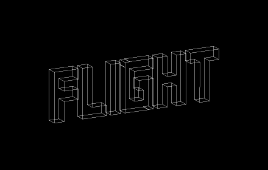
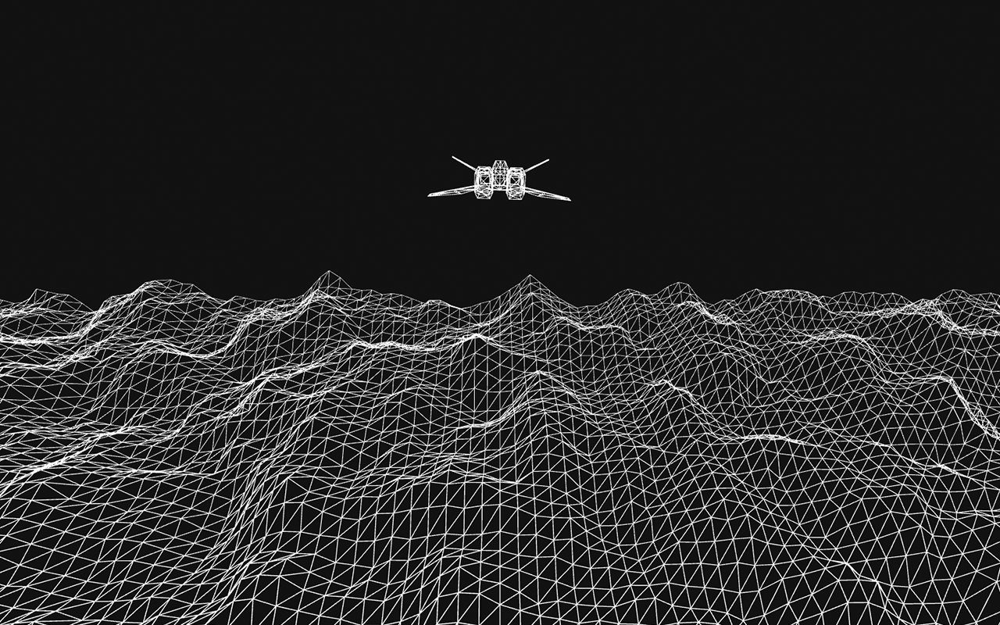

# Flight

A WebGL wireframe flight experience on your new tab. This is available as an open source project and an official Chrome extension available in the Google web store.

This project uses Perlin noise and basic 3D objects to provide a smooth, satisfying flight experience.

## Demo

<video width="640" height="480" controls>
  <source src="assets/flight_demo.mp4" type="video/mp4">
</video>

## Acknowledgements

 - [Coding Train](https://www.youtube.com/watch?v=IKB1hWWedMk&ab_channel=TheCodingTrain)
 - [p5.js](https://p5js.org/learn/getting-started-in-webgl-coords-and-transform.html)
## Installation

Install it via [Chrome's web store](https://chrome.google.com/webstore/detail/flight/neoeiigoflhjcldhhgodjmdkiodlkjbg?hl=en&authuser=2) or locally. All necessary libraries are included.
